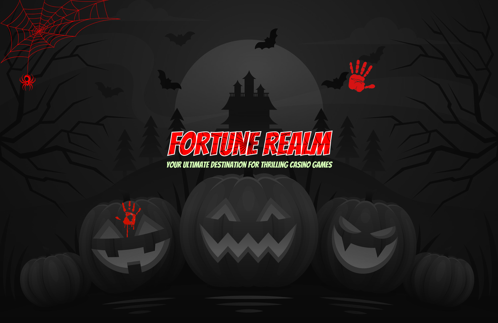
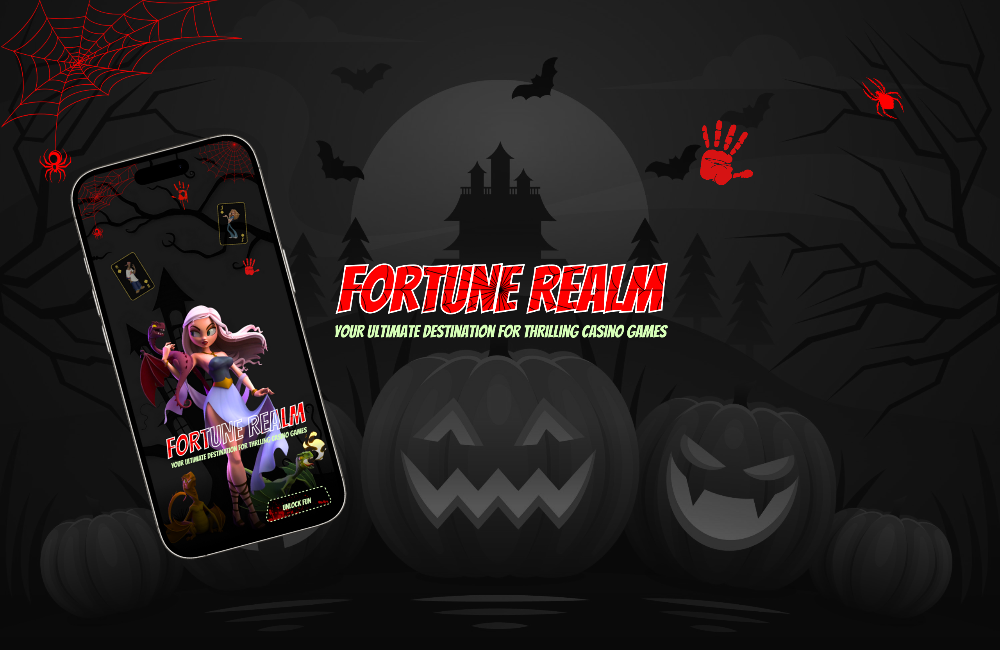
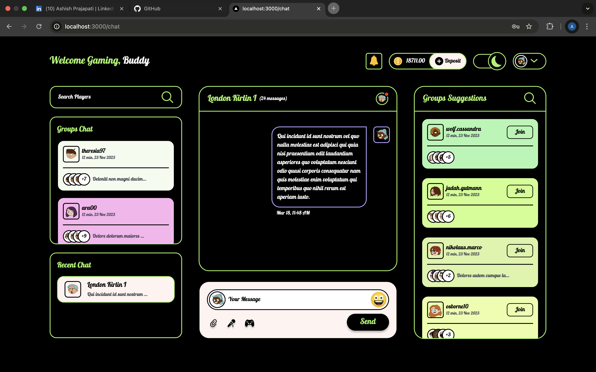
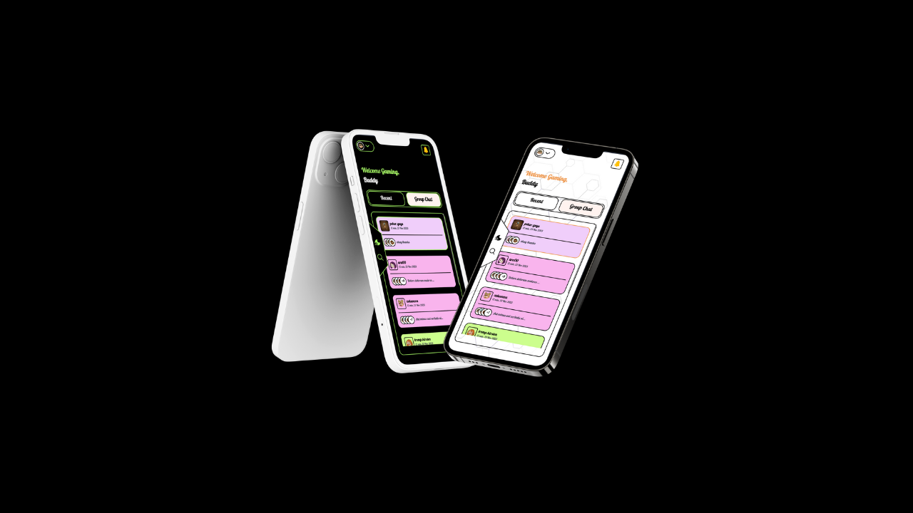
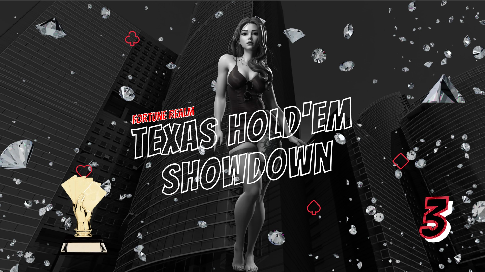

# 💫 About Me:
## 👋 Hi, I'm Ashish Prajapati
* 💻 Software Developer with 1.5 years of experience
* ⚛️ Strong expertise in JavaScript, React.js, and Redux
* 🎯 Focused on front-end development with solid UI/UX understanding
* 🌐 Hands-on experience with back-end development from past company work and recent full-stack projects
* 🚀 Passionate about building clean, scalable, and efficient applications
* 🧠 Always eager to learn and explore new technologies

## 🌐 Socials:
  

# 💻 Tech Stack:
     

# 📜 Projects Demo
<table>
  <tr>
    <td align="center">
      <a href="https://vimeo.com/1070551148/a3cb2833d9?ts=0&share=copy">
         
        <strong>Fortune Realm Login Screen – A Spooky Welcome!</strong>
      </a>
      

Step into Fortune Realm with a Halloween-themed login page! A floating Jack-o’-lantern and a haunted car set the spooky vibe, while a game preview section teases the exciting card games ahead.

A thrilling welcome to the world of Fortune Realm!

    </td>
    <td align="center">
      <a href="https://vimeo.com/1072794834/2b79c4aee9?ts=0&share=copy">
         
        <strong>Fortune Realm Login Screen – A Spooky Welcome! (Mobile)</strong>
      </a>
      
Step into Fortune Realm with a Halloween-themed login page! A floating Jack-o’-lantern and a haunted car set the spooky vibe, while a game preview section teases the exciting card games ahead.

A thrilling welcome to the world of Fortune Realm!

    </td>
  </tr>
  <tr>
    <td align="center">
      <a href="https://vimeo.com/1078178899/3dcb4b3573">
         
        <strong>💬 Advanced Chat System</strong>
      </a>
      
The Fortune Realm chat page is designed for seamless player interaction, featuring Group & one-on-one live chat, Real-time user status updates, Dark & light theme customization

, Group search & join requests for easy connections, Game invitations to invite others for a match

    </td>
    <td align="center">
      <a href="https://vimeo.com/1080225707/1c3a7259af">
         
        <strong>💬 Advanced Chat System (Mobile)</strong>
      </a>
      
The Fortune Realm chat page is designed for seamless player interaction, featuring Group & one-on-one live chat, Real-time user status updates, Dark & light theme customization

, Group search & join requests for easy connections, Game invitations to invite others for a match

    </td>
  </tr>
  <tr>
    <td align="center">
       <a href="https://vimeo.com/1086009735/d2a73ec3cb?ts=0&share=copy">
         
        <strong>🎮 Texas Hold’em Showdown – Fortune Realm’s Ultimate Poker Experience</strong>
      </a>
      
Texas Hold’em Showdown is an immersive, real-time multiplayer poker experience within the Fortune Realm platform. Players can buy in with their preferred chip amount, get seated automatically, and enjoy smooth dealer animations as hole cards are dealt. The game features intuitive poker actions like check, call, fold, and raise, all within a timed turn system to keep gameplay flowing. With a clean UI, it delivers a competitive yet visually engaging poker session for all players.

    </td>
    <td align="center">
      Coming Soon!
    </td>
  </tr>
</table>

# 📊 GitHub Stats:
 
 

## 🏆 GitHub Trophies

### ✍️ Random Dev Quote

### 🔝 Top Contributed Repo

---

<!-- Proudly created with GPRM ( https://gprm.itsvg.in ) -->
